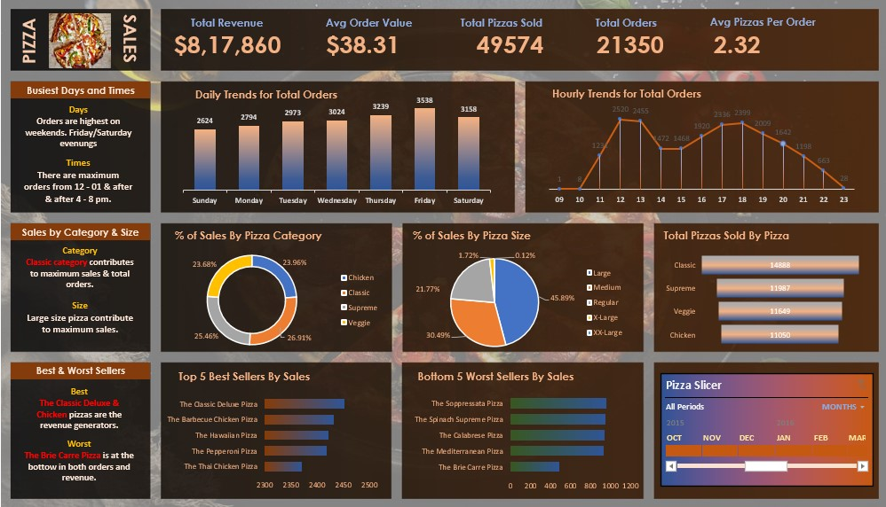

# 🍕 Pizza Sales Data Analysis (SQL + Excel)

## 📌 Project Overview

This project is an end-to-end **data analytics solution** built using **PostgreSQL and Microsoft Excel** to analyze pizza sales data.  

The goal is to uncover key business insights such as revenue performance, customer ordering patterns, and product popularity through SQL-based analysis and an interactive Excel dashboard.

---

## 🎯 Business Objective

The pizza company wanted to analyze historical sales data to understand:

- Overall business performance
- Customer ordering behavior
- Peak sales time periods
- Best and worst performing pizzas
- Sales contribution by category and size

The final goal is to support **data-driven business decisions**.

---

## 📊 Key Performance Indicators (KPIs)

The following KPIs were calculated using SQL:

- 💰 Total Revenue
- 📦 Total Orders
- 🍕 Total Pizzas Sold
- 📈 Average Order Value
- 📊 Average Pizzas per Order

---

## 📁 Dataset Information

The dataset contains detailed pizza order transactions with the following fields:

- Pizza ID
- Order ID
- Pizza Name
- Pizza Category
- Pizza Size
- Quantity
- Unit Price
- Total Price
- Order Date
- Order Time
- Ingredients

---

## 🛠️ Tools & Technologies Used

- PostgreSQL (Data Storage & SQL Analysis)
- SQL (Data Cleaning & KPI Calculation)
- Microsoft Excel (Dashboard Creation)
- Pivot Tables & Pivot Charts
- Data Visualization

---

## 📊 Analysis Performed

### 1. Sales Performance Analysis
- Total revenue calculation
- Total orders and quantity sold
- Average order value

### 2. Time-Based Analysis
- Daily order trends
- Hourly order distribution
- Peak business hours identification

### 3. Product Analysis
- Revenue by pizza category
- Revenue by pizza size
- Total pizzas sold per category

### 4. Top & Bottom Performers
- Top 5 best-selling pizzas
- Bottom 5 worst-selling pizzas

---

## 📈 Dashboard Preview

---

## 📊 Key Insights

- Large-sized pizzas generated the highest revenue contribution.
- Peak ordering hours were between **12 PM–2 PM and 6 PM–8 PM**.
- Friday and Saturday had the highest number of orders.
- The **Classic category** contributed the most to total revenue.
- A small number of pizzas contributed to the majority of sales.

---

## 🧠 SQL Concepts Used

- Aggregation functions (SUM, COUNT, AVG)
- GROUP BY and ORDER BY
- Window functions
- Date and time functions (TO_CHAR)
- Type casting and rounding
- Subqueries

